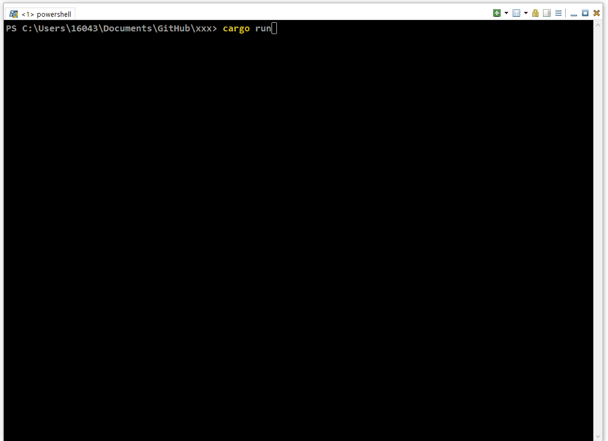

# Mouse Driven Rust Terminal Podcast Downloader 

Interaction via mouse click and scroll. Paste into text boxes with Control-V.

Buttons have hover and state effects. Tab between text input boxes.

Screen capture via [ScreenToGif](https://www.screentogif.com/).

TUI - Terminal User Interface with [Ratatui.rs](https://ratatui.rs/).

